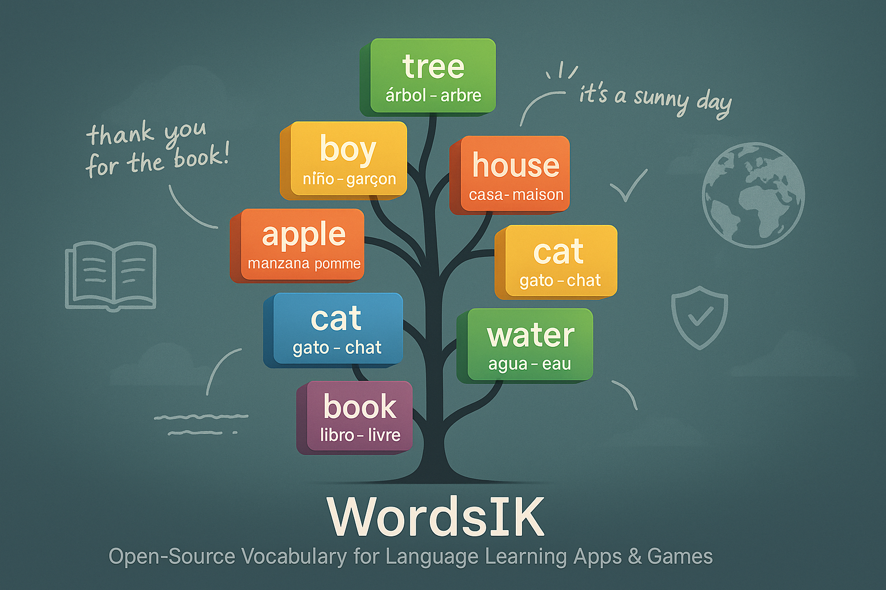

# WordsIK - Educational Vocabulary Repository



A collaborative repository for educational vocabulary, grammar, and spelling resources that can be used to build language learning games and applications. Built with robust quality assurance and multi-language support.

## 🚀 Features

- **Multi-language Support**: English, Spanish, French, Arabic, Korean with extensible structure
- **Quality Assurance**: Automated validation, spell checking, and content filtering
- **CI/CD Pipeline**: Comprehensive GitHub Actions workflow with security scanning
- **Educational Focus**: Age-appropriate content organized by grade levels
- **Cultural Sensitivity**: Built-in checks for inclusive and appropriate language
- **TypeScript**: Full TypeScript support with strict type checking
- **Modern Tooling**: ESLint, Prettier, Jest, and Husky for code quality

## 📁 Repository Structure

```
.
├── src/                # TypeScript source code
│   ├── cli.ts         # Command-line interface
│   ├── ValidationManager.ts # Main validation logic
│   ├── utils/         # Utility functions
│   │   ├── Logger.ts  # Logging with chalk support
│   │   ├── FileUtils.ts # File operations
│   │   └── ReviewGenerator.ts # Code review generation
│   ├── validators/    # Content validation modules
│   └── types/         # TypeScript type definitions
├── data/              # Main content directory
│   ├── vocabulary/    # Vocabulary content by language and grade
│   ├── grammar/       # Grammar lessons and exercises
│   └── spelling/      # Spelling lists and activities
├── validation/        # Content validation tools
├── docs/             # Documentation and guidelines
├── templates/        # JSON templates for new contributions
├── .github/workflows/ # CI/CD pipeline configuration
└── examples/         # Sample content and activities
```

## 🔧 Quality Assurance System

### Automated Checks

Our CI/CD pipeline runs on every pull request and includes:

1. **Security Scanning**

   - Gitleaks for secret detection
   - TruffleHog for credential scanning
   - Pattern matching for sensitive data

2. **Content Validation**

   - JSON syntax validation
   - Profanity filtering using `bad-words` library
   - Structure validation for educational content

3. **Code Quality**

   - TypeScript compilation with strict mode
   - ESLint with TypeScript rules
   - Jest unit testing
   - Pre-commit hooks with lint-staged

4. **Spell Checking**

   - Multi-language spell checking with cspell
   - Built-in dictionaries for English, Spanish, and French
   - Custom educational terminology support

5. **Documentation Linting**

   - Vale integration for writing quality
   - Microsoft style guide compliance
   - Write-good and proselint rules

6. **Multi-language Validation**
   - UTF-8 encoding verification
   - Language-specific character validation
   - Translation consistency checks

### Local Development

```bash
# Install dependencies
npm install

# Build TypeScript
npm run build

# Run all validations
npm run validate-all

# Check specific content
npm run validate-json
npm run validate-content
npm run validate-translations

# Run tests
npm test

# Lint code
npm run lint:ts
npm run lint:fix

# Spell check
npm run spell-check

# Clean build artifacts
npm run clean
```

## 📝 Content Format

Each vocabulary file follows this JSON structure:

```json
{
  "week": "1",
  "theme": "Animals",
  "words": [
    {
      "word": "cat",
      "translation": "gato",
      "definition": "A small domesticated carnivorous mammal",
      "example": "The cat is sleeping on the sofa.",
      "difficulty": "easy",
      "category": "animals"
    }
  ]
}
```

### Required Fields

- `week`: Week number or identifier
- `theme`: Content theme or topic
- `words`: Array of word objects

### Word Object Fields

- `word`: The target word (required)
- `translation`: Translation in target language (required)
- `definition`: Clear definition (required)
- `example`: Usage example (required)
- `difficulty`: "easy", "medium", or "hard" (optional)
- `category`: Content category (optional)

## 🌍 Multi-Language Support

### Supported Languages

- **English (en)**: Primary language with comprehensive content
- **Spanish (es)**: Full vocabulary and grammar support
- **French (fr)**: Complete educational content
- **Arabic (ar)**: Basic vocabulary support
- **Korean (ko)**: Basic vocabulary support

### Adding New Languages

1. Create language directory structure: `data/vocabulary/[new-lang]/`
2. Add language metadata to `lang-data.json`
3. Provide sample content for validation
4. Update documentation

### Language Validation

- **Native Speaker Review**: All content reviewed by native speakers
- **Cultural Context**: Examples appropriate for target culture
- **Regional Variations**: Noted when significant differences exist
- **Character Encoding**: UTF-8 encoding for all files

## 🤝 Contributing

We welcome contributions from teachers, linguists, and educational content creators!

### Quick Start

1. **Fork the repository**
2. **Clone your fork**:
   ```bash
   git clone https://github.com/YOUR_USERNAME/wordsIK.git
   cd wordsIK
   npm install
   ```
3. **Create a feature branch**:
   ```bash
   git checkout -b feature/add-new-vocabulary
   ```
4. **Add your content** following the structure guidelines
5. **Run validation locally**:
   ```bash
   npm run validate-all
   npm run lint:ts
   npm test
   ```
6. **Submit a pull request**

### Quality Standards

All contributions must pass:

- ✅ Age-appropriate content for target grade
- ✅ Accurate translations and cultural appropriateness
- ✅ Clear, educational examples
- ✅ Proper JSON formatting
- ✅ No sensitive information
- ✅ Follows established structure
- ✅ Passes all automated checks
- ✅ TypeScript compilation without errors
- ✅ ESLint rules compliance

### Pre-commit Hooks

The repository includes pre-commit hooks that automatically:

- Validate JSON syntax
- Check for profanity
- Run spell checking
- Verify content structure
- Lint TypeScript code
- Run unit tests

## 🔒 Security & Privacy

- **Secret Scanning**: Automated detection of API keys, passwords, and tokens
- **Content Filtering**: Built-in profanity and inappropriate content detection
- **Access Control**: Repository-level security with branch protection
- **Audit Trail**: Complete history of all content changes

## 📊 Usage Examples

This repository is designed to be used as a data source for:

- **Educational Games**: Vocabulary builders, word searches, spelling games
- **Language Learning Apps**: Flashcard applications, quiz generators
- **Classroom Tools**: Interactive whiteboard activities, worksheets
- **Assessment Systems**: Automated testing and progress tracking

## 🛠️ Development

### Prerequisites

- Node.js (v18 or higher)
- npm (v8 or higher)
- Git

### Setup

```bash
# Clone the repository
git clone https://github.com/your-username/wordsIK.git
cd wordsIK

# Install dependencies
npm install

# Set up pre-commit hooks
npm run prepare

# Build the project
npm run build

# Run validation
npm run validate-all
```

### Testing

```bash
# Run all tests
npm test

# Run tests with coverage
npm run test:coverage

# Run tests in watch mode
npm run test:watch

# Validate specific content
npm run validate-content

# Check documentation
vale docs/ *.md
```

## 📚 Documentation

- [Contributing Guidelines](CONTRIBUTING.md) - Detailed contribution process
- [API Documentation](docs/api/) - Technical integration guides
- [Teacher Guide](docs/guides/teacher-guide.md) - Educational usage guide
- [Validation Guide](docs/validation/) - Content validation rules

## 🤝 Community

- **Issues**: Report bugs and request features
- **Discussions**: Ask questions and share ideas
- **Pull Requests**: Contribute content and improvements
- **Code of Conduct**: Maintain a welcoming environment

## 📄 License

This project is licensed under the MIT License - see the [LICENSE](LICENSE) file for details.

## 🙏 Acknowledgments

- Teachers and educators who contribute content
- Native speakers who validate translations
- Open source tools that power our validation system
- Educational institutions that use our content

---

**Made with ❤️ for education**
