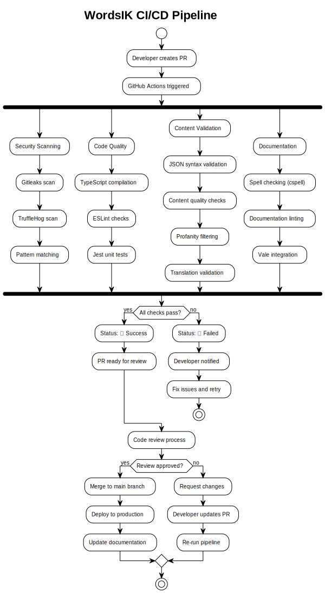

# WordsIK CI/CD Pipeline Guide

This document explains the Continuous Integration and Continuous Deployment (CI/CD) pipeline used in the WordsIK project.

## Overview

The WordsIK CI/CD pipeline is built using GitHub Actions and runs automatically on every pull request and push to the main branch. The pipeline ensures code quality, content validation, and security compliance.

## Pipeline Flow



The diagram above shows the complete flow of our CI/CD pipeline, from code submission to deployment. Each stage includes automated checks and quality gates to ensure only high-quality content reaches production.

### Pipeline Stages Overview

1. **Security Scanning** - Detect sensitive information and vulnerabilities
2. **Code Quality** - Ensure code meets quality standards
3. **Content Validation** - Validate educational content quality and structure
4. **Documentation** - Ensure documentation quality and consistency

## Pipeline Stages

### 1. Security Scanning

**Purpose**: Detect sensitive information and security vulnerabilities

**Tools Used**:

- **Gitleaks**: Scans for secrets, API keys, and credentials
- **TruffleHog**: Deep scanning for embedded secrets
- **Pattern Matching**: Custom patterns for sensitive data

**Configuration**: `.github/workflows/ci.yml`

```yaml
- name: Security Scan
  uses: gitleaks/gitleaks-action@v2
  env:
    GITHUB_TOKEN: ${{ secrets.GITHUB_TOKEN }}
```

**What it checks**:

- API keys and tokens
- Database credentials
- Private keys
- Passwords and secrets
- Personal information

### 2. Code Quality

**Purpose**: Ensure code meets quality standards

**Tools Used**:

- **TypeScript**: Compilation with strict mode
- **ESLint**: Code linting with TypeScript rules
- **Jest**: Unit testing with coverage

**Configuration**: `eslint.config.js`, `jest.config.js`

```yaml
- name: TypeScript Build
  run: npm run build

- name: ESLint
  run: npm run lint:ts

- name: Jest Tests
  run: npm run test:ci
```

**What it checks**:

- TypeScript compilation errors
- Code style violations
- Unit test coverage
- Type safety

### 3. Content Validation

**Purpose**: Validate educational content quality and structure

**Tools Used**:

- **Custom Validators**: JSON structure validation
- **Content Quality Checks**: Educational appropriateness
- **Profanity Filtering**: Inappropriate content detection
- **Translation Validation**: Consistency across languages

**Configuration**: `src/validators/`

```yaml
- name: Content Validation
  run: npm run validate-all

- name: Content Quality
  run: npm run validate --content --verbose
```

**What it checks**:

- JSON syntax validity
- Required field presence
- Content age-appropriateness
- Cultural sensitivity
- Translation consistency
- Profanity and inappropriate content

### 4. Documentation

**Purpose**: Ensure documentation quality and consistency

**Tools Used**:

- **cspell**: Multi-language spell checking
- **Vale**: Documentation style guide compliance
- **Write-good**: Writing quality checks

**Configuration**: `.cspell.cjson`

```yaml
- name: Spell Check
  run: npm run spell-check

- name: Documentation Lint
  run: vale docs/ *.md
```

**What it checks**:

- Spelling errors in multiple languages
- Documentation style compliance
- Writing quality and clarity
- Link validity

## Pipeline Configuration

### GitHub Actions Workflow

**File**: `.github/workflows/ci.yml`

```yaml
name: CI/CD Pipeline

on:
  pull_request:
    branches: [main]
  push:
    branches: [main]

jobs:
  security:
    runs-on: ubuntu-latest
    steps:
      - uses: actions/checkout@v3
      - name: Security Scan
        uses: gitleaks/gitleaks-action@v2

  quality:
    runs-on: ubuntu-latest
    steps:
      - uses: actions/checkout@v3
      - uses: actions/setup-node@v3
        with:
          node-version: "18"
      - run: npm ci
      - run: npm run build
      - run: npm run lint:ts
      - run: npm run test:ci

  content:
    runs-on: ubuntu-latest
    steps:
      - uses: actions/checkout@v3
      - uses: actions/setup-node@v3
        with:
          node-version: "18"
      - run: npm ci
      - run: npm run validate-all

  documentation:
    runs-on: ubuntu-latest
    steps:
      - uses: actions/checkout@v3
      - run: npm ci
      - run: npm run spell-check
```

### Environment Variables

**Required Secrets**:

- `GITHUB_TOKEN`: Automatically provided by GitHub
- `NPM_TOKEN`: For publishing packages (if applicable)

**Optional Secrets**:

- `SLACK_WEBHOOK`: For notifications
- `EMAIL_SERVICE`: For email notifications

## Pipeline Triggers

### Automatic Triggers

1. **Pull Request**: Runs on every PR to main branch
2. **Push to Main**: Runs on every push to main branch
3. **Manual Trigger**: Can be triggered manually from GitHub UI

### Conditional Execution

```yaml
# Only run on specific file changes
on:
  pull_request:
    paths:
      - "src/**"
      - "data/**"
      - "docs/**"
      - "package.json"
      - "tsconfig.json"
```

## Pipeline Status

### Success Criteria

All stages must pass for the pipeline to succeed:

1. ✅ **Security**: No secrets or vulnerabilities detected
2. ✅ **Code Quality**: TypeScript compiles, tests pass, linting clean
3. ✅ **Content**: All validation checks pass
4. ✅ **Documentation**: Spell check and style guide compliance

### Failure Handling

When the pipeline fails:

1. **Immediate Notification**: Developer receives failure notification
2. **Detailed Logs**: Full error logs available in GitHub Actions
3. **Retry Mechanism**: Can be retried after fixing issues
4. **Blocking**: PR cannot be merged until pipeline passes

## Local Development

### Pre-commit Hooks

Local development uses pre-commit hooks to catch issues early:

```bash
# Install pre-commit hooks
npm run prepare

# Run validation locally
npm run validate-all

# Run tests locally
npm run test

# Run linting locally
npm run lint:ts
```

### Local Pipeline Simulation

```bash
# Simulate full pipeline locally
npm run ci:local

# This runs:
# 1. npm run build
# 2. npm run lint:ts
# 3. npm run test:ci
# 4. npm run validate-all
# 5. npm run spell-check
```

## Monitoring and Notifications

### Pipeline Monitoring

- **GitHub Actions Dashboard**: Real-time pipeline status
- **Email Notifications**: Configured for pipeline failures
- **Slack Integration**: Optional team notifications

### Metrics and Reporting

- **Build Success Rate**: Track pipeline reliability
- **Test Coverage**: Monitor test coverage trends
- **Validation Errors**: Track content quality issues
- **Security Alerts**: Monitor security scan results

## Troubleshooting

### Common Issues

1. **TypeScript Compilation Errors**

   ```bash
   npm run build
   # Fix type errors and retry
   ```

2. **ESLint Violations**

   ```bash
   npm run lint:ts
   npm run lint:fix  # Auto-fix where possible
   ```

3. **Content Validation Failures**

   ```bash
   npm run validate --verbose
   # Check specific validation errors
   ```

4. **Test Failures**
   ```bash
   npm run test
   # Fix failing tests and retry
   ```

### Debug Mode

Enable debug logging for troubleshooting:

```bash
# Enable debug mode
export DEBUG=true
npm run validate --debug

# Check detailed logs
npm run logs:view
```

## Best Practices

### For Developers

1. **Run Locally First**: Always test locally before pushing
2. **Small Changes**: Make small, focused changes
3. **Clear Commit Messages**: Use conventional commit format
4. **Test Coverage**: Maintain high test coverage

### For Maintainers

1. **Monitor Pipeline**: Check pipeline status regularly
2. **Review Failures**: Investigate and fix pipeline failures
3. **Update Dependencies**: Keep tools and dependencies updated
4. **Documentation**: Keep pipeline documentation current

## Future Enhancements

### Planned Improvements

1. **Performance Optimization**: Parallel job execution
2. **Caching**: Cache dependencies for faster builds
3. **Advanced Security**: Additional security scanning tools
4. **Deployment Automation**: Automated deployment to staging/production
5. **Metrics Dashboard**: Real-time pipeline metrics

### Integration Opportunities

1. **Code Coverage**: Integration with coverage reporting tools
2. **Security Scanning**: Integration with additional security tools
3. **Performance Testing**: Add performance regression testing
4. **Accessibility Testing**: Add accessibility compliance checks

---

_This CI/CD guide is part of the WordsIK project. For more information, see the main [README](../README.md)._
